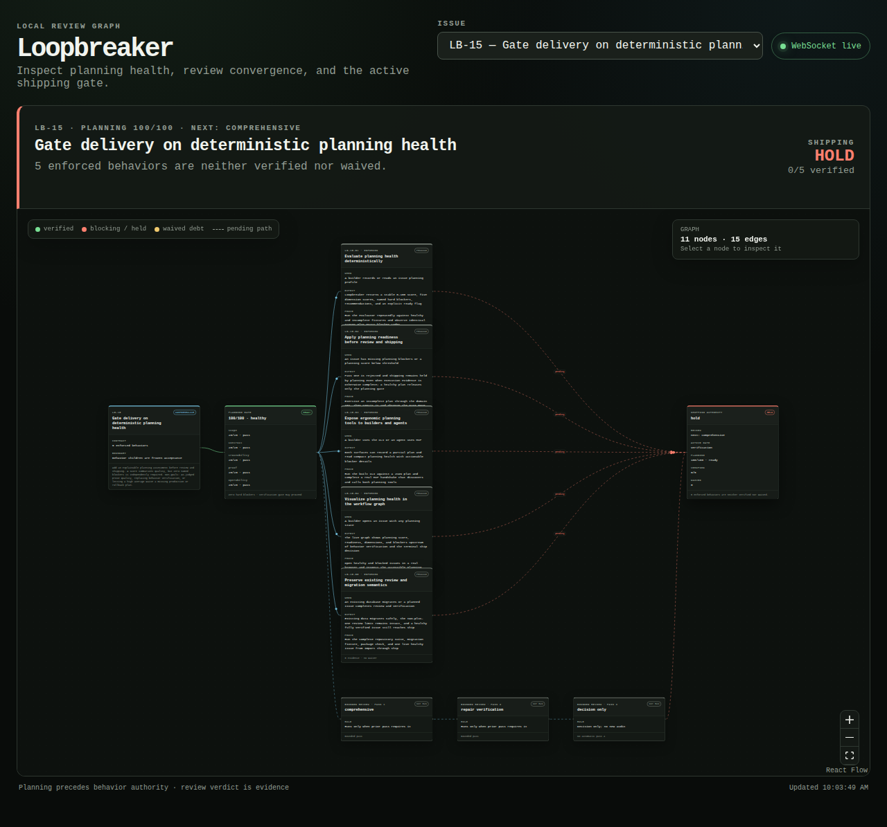

# Loopbreaker

**A meta-harness for coding agents.** Loopbreaker combines MCP tools, a CLI,
lifecycle hooks, agent skills, and a structured entity ontology into one
strict-but-bounded surface for implementation and review — with human elicitation
and approval required before any work can start, and every behavior verified by a
test loopbreaker runs itself, never a claim.

It is the small public demo extracted from a deeper review-and-shipping feature
embedded in [Rordi](https://github.com/rordi-ai). It drives an AI coding agent
through one ordered session — discovery → a human approval → shape → plan → an
independent, cross-vendor plan review → build-and-prove → a bounded code review →
ship — recording every step as rows in a local SQLite file: the issue's discovery
record, shape decision, planning health, independent planning approval, enforced
behaviors, executed evidence, findings, bounded review passes, and human waivers.
The same substrate is exposed to agents over MCP and rendered as a live workflow
graph.

**Why "loopbreaker."** Review is where these processes usually loop without end —
every pass finds something new, so it never converges. Loopbreaker bounds it: at
most three passes, then the round ends, and reopening is a named human act. Three
lessons shaped the rest:

- **Review convergence and shipping readiness are different facts.** A reviewer
  can finish checking a repair while an enforced behavior still lacks
  production-relevant proof; conflating them made review loops grow indefinitely.
- **A verification gate cannot rescue an unshaped issue** — scope, work ownership,
  proof plan, production wiring, and rollback have to be explicit first.
- **A pipeline that verifies each stage against the one above never checks the
  premise at the top** — so a wrong premise hardens into rigorously certified
  wrong software. Discovery is therefore the first authority, and it must come
  from a human.

Loopbreaker makes the distinct authorities explicit and ordered: founder-approved
discovery, shape, structural planning health, independent planning approval,
implementation review, and shipping readiness.

## The five surfaces it combines

- **MCP tools** — the same substrate an agent drives, as focused tools over stdio.
- **a CLI** — every step as a `loopbreaker` command; TOON on stdout.
- **lifecycle hooks** ([`src/hooks.ts`](src/hooks.ts)) — `SessionStart` prepends
  the ordered pipeline and which tools to use to the agent's context; `PreToolUse`
  denies source edits until the issue is admitted and replies with the exact
  active gate. Shell commands and reads pass straight through.
- **agent skills** — the seven below, invoked by name.
- **a structured entity ontology** — a local SQLite schema (issues, behaviors,
  evidence, findings, review passes, discovery records, …) whose domain rules are
  CHECK constraints: `pass_number BETWEEN 1 AND 3` is literally "no pass four," and
  `verdict IN ('pass','fail','not_run')` makes a missing proof its own state.

The seven reusable agent skills:

- `discovery-interview` — interview until every shape field traces to a human answer.
- `shape-strategy` — frame appetite, reversibility, smallest slice, and success.
- `plan-feature` — freeze enforced behaviors and reach healthy planning.
- `review-planning` — independently approve or redirect shape and planning in at most three passes.
- `implement-feature` — build only a planning-ready contract and record evidence.
- `review-invariants` — enforce planning preflight, two-plus-one review, and ship authority.
- `orchestrate-delivery` — run the whole pipeline as three separated roles: a root
  orchestrator, per-work-unit workers in isolated worktrees, and an independent
  cross-vendor CLI reviewer recording its own findings over MCP.



## Try the incident

Requires Node.js 22.5+ and pnpm.

```sh
git clone https://github.com/rordi-ai/loopbreaker.git
cd loopbreaker
pnpm install
pnpm build

node dist/cli.js demo
node dist/cli.js
node dist/cli.js substrate DEMO-1
node dist/cli.js serve
```

Open <http://127.0.0.1:7331>. The seeded incident starts here:

- One comprehensive pass compresses thirteen legacy review iterations.
- Planning health is 100/100 with zero hard blockers.
- Two of three enforced behaviors are verified.
- A unit test exists for the third behavior, but wired replay proof does not.
- Review's next action is repair verification; shipping is held.

Use **Record repair pass**. Review becomes complete, but shipping remains held.
Then use **Add wired proof**. The behavior becomes verified and the disposition
changes to ship. The two decisions never overwrite one another.

**Add wired proof** now *executes* `DEMO-B3`'s registered harness and records the
exit code. It used to record an asserted `wired`/`pass` row and verify on it —
which is exactly the injection this project argues against, shipped in its own
demo. The gate caught it the day the gate existed.

The graph is inspectable but deliberately read-only: pan, zoom, focus, and
select nodes to trace the contract, proof, findings, review budget, and ship
decision. A WebSocket carries changes made by another CLI or MCP process into
the open graph. If that connection drops, the status badge changes to
**Polling recovery** and the client keeps converging through interval polling.
Use `?transport=poll` when you want to exercise that recovery path explicitly.

CLI stdout uses [TOON](https://toonformat.dev/) so agents receive compact,
regular data. The database defaults to `.loopbreaker/loopbreaker.db`; override
it with `--db PATH` or `LOOPBREAKER_DB`.

## Install as a Codex plugin

The repository is a complete plugin: [.codex-plugin/plugin.json](.codex-plugin/plugin.json)
registers the seven skills and [.mcp.json](.mcp.json) starts the bundled local MCP
server. No TypeScript runtime is needed after the repository has been built.

```sh
pnpm install
pnpm build
```

The generated `mcp/server.bundle.mjs` is the plugin entry point. Set
`LOOPBREAKER_DB` in your MCP environment when you want an explicit database path;
otherwise the server uses `.loopbreaker/loopbreaker.db` under its working directory.

## Install as a Claude Code plugin

The same repository is also a Claude Code plugin:
[.claude-plugin/plugin.json](.claude-plugin/plugin.json) starts the bundled MCP
server (database at `.loopbreaker/loopbreaker.db` under the current project), and
the seven skills under [skills/](skills/) are auto-discovered as
`/loopbreaker:<skill-name>`. The `impl-worker` subagent used by
`orchestrate-delivery` is auto-discovered from [agents/](agents/).

```sh
pnpm install && pnpm build
claude --plugin-dir /path/to/loopbreaker
```

Or install it persistently from GitHub:

```text
/plugin marketplace add rordi-ai/loopbreaker
/plugin install loopbreaker@loopbreaker
```

Working inside this repository needs no install at all: the project-scope
[.mcp.json](.mcp.json) loads the same bundled server directly.

## Use it with any MCP client

Build the repo, then add this local stdio server to your MCP client config:

```json
{
  "mcpServers": {
    "loopbreaker": {
      "command": "node",
      "args": [
        "/absolute/path/to/loopbreaker/dist/cli.js",
        "mcp",
        "--db",
        "/absolute/path/to/review.db"
      ]
    }
  }
}
```

The server tells agents to read the ordered delivery authority before implementation
or review, load the substrate, and check ship status separately. It exposes eighteen focused tools:

| Tool | Purpose |
| --- | --- |
| `discovery_record` | Record the founder interview, one answer per required shape field |
| `discovery_state` | Read the discovery record and whether it is approved |
| `review_import_contract` | Import behavior children; enforced unless explicitly advisory |
| `shape_record` | Persist the explicit proceed, spike, park, or reject shape decision |
| `planning_record` | Record a partial or complete pre-review planning profile |
| `planning_health` | Read score, five dimensions, blockers, and readiness |
| `delivery_readiness` | Read discovery → shape → planning → planning-review → implementation → shipping authority |
| `planning_review_upsert_finding` | Preserve a stable semantic shape/planning finding |
| `planning_review_record_pass` | Record the next independent planning-review pass, limited to 1–3 |
| `review_list_issues` | List derived review and shipping states |
| `review_substrate` | Read the complete frozen review surface |
| `review_upsert_finding` | Preserve one stable row per review root cause |
| `review_record_pass` | Record the next pass, limited to 1–3 |
| `review_record_evidence` | Attach unit, wired, or live proof |
| `review_verify_behavior` | Verify a behavior using executed passing evidence |
| `review_create_waiver` | Accept named debt with an approver and rationale |
| `review_ship_status` | Read the authoritative ship disposition |

There is deliberately **no discovery approval tool**. Recording the interview is
the agent's job; approving it is not — so approval exists only on the CLI or in
the browser (the "Needs you" inbox), never as a call an agent can make.

The MCP results are TOON text blocks. Run a real client/server handshake with:

```sh
pnpm verify:mcp
```

## Import your own issue

Start from [examples/issue-contract.json](examples/issue-contract.json):

```sh
node dist/cli.js import examples/issue-contract.json --db my-review.db
node dist/cli.js shape APP-42 examples/shape.json --db my-review.db
node dist/cli.js health APP-42 --db my-review.db
node dist/cli.js readiness APP-42 --db my-review.db
node dist/cli.js substrate APP-42 --db my-review.db
```

Every behavior is enforced by default. Set `"advisory": true` only when a
behavior genuinely is not part of the ship gate. Once the first review pass is
recorded, changing the contract is rejected: parent context can interpret the
behavior children, but cannot silently add requirements mid-review.

Planning health is deterministic and intentionally conjunctive. The score covers
scope, contract quality, work-unit traceability, proof design, and operability.
Readiness requires both a score of at least 80 and zero hard blockers. Missing
behavior ownership, wired/live proof, production wiring, or rollback cannot be
averaged away. Partial profiles are accepted so the tool can return actionable
blockers; `loopbreaker health ISSUE` is the structural surface and
`loopbreaker readiness ISSUE` is the ordered admission surface. A 100/100 plan
still cannot admit implementation until an independent bounded planning review
records `approved`.

## Evidence is executed, not asserted

An enforced behavior can only be verified on a proof loopbreaker ran itself. The
verdict comes from a harness exit code; nothing accepts an outcome from a caller.

```sh
node dist/cli.js harnesses                       # what is registered, and at which tier
node dist/cli.js bind APP-42-B1 --harness my-h   # point a behavior at an entry
node dist/cli.js prove APP-42-B1                 # run it; the exit code is the verdict
node dist/cli.js demote --dry-run                # what was verified without ever executing
```

[harnesses.json](harnesses.json) is the registry. A behavior names an entry id,
never a command, so the set of executable things is a reviewable file rather than
an opaque string in a database. Each entry declares its own `tier`, which is what
makes proof tier honest — typing `wired` no longer makes a proof wired.

Binding takes two independent acts: the behavior names the harness (a data
change) and the entry names the behavior back in `proves` (a code change that
shows up in a diff). Without the second, a behavior could be pointed at a harness
that cannot fail. An entry with no `proves` consents to nothing.

`not_run` is the fail-closed default. A harness that could not execute records
that fact and never verifies anything: failing to observe a pass is not the same
as passing.

`prove` rejects `--verdict` and `--tier` rather than ignoring them. A caller
chooses *which* registered harness runs, never what the run concluded.

## The premise needs a human

Discovery is the first ordered authority. A shape cannot reach `proceed` until
every required field traces to an answer a human gave and approved.

```sh
node dist/cli.js discover APP-42 discovery.json          # one answer per field
node dist/cli.js discover APP-42 --approve --by NAME     # the human approves
node dist/cli.js discovery APP-42                        # draft, approved, or grandfathered
```

Or approve it in the browser — `loopbreaker serve` shows **Approve the premise**
on any issue held at discovery. That path is stamped `web` rather than `cli`, so
a browser approval is distinguishable from a terminal one.

MCP can *record* an interview (`discovery_record`) but has **no approval tool**.
Recording is the agent's job; approving is not.

Re-recording answers returns an approved record to draft — a premise edited after
approval would have the gate vouch for text the approver never read. Issues that
predate the gate are grandfathered, recorded as data so the exempt cohort is
inspectable.

**This is attribution, not prevention.** An agent with a shell can reach the HTTP
surface as easily as the CLI, so `web` records which channel a write came through
— not that a human was behind it. Closing that needs a one-time token delivered
out of band, which is not built.

Build a behavior's harness and prove it **red** against current HEAD before
implementing. A harness that is green before the work exists proves nothing.

## The decision model

Both planning review and implementation review are bounded to a two-plus-one budget:

1. **Comprehensive** — find the coherent set of issues against the frozen contract.
2. **Repair verification** — check admitted repairs and repair regressions.
3. **Decision only** — ship, ship with debt, split/re-scope, or hold for one named critical risk.

There is no automatic pass 4. A passing pass can complete review early. Neither
case grants permission to ship.

Shipping is derived through ordered authorities:

- discovery `hold`: no founder-approved discovery record exists, so the premise has no human behind it;
- shape `hold`: the explicit shape is missing, incomplete, or not `proceed`;
- planning `hold`: structural planning health is not ready;
- planning-review `hold`: semantic review has not independently approved implementation;
- verification `hold`: earlier gates are ready but an enforced behavior is unresolved;
- `ship`: all earlier gates are ready and every enforced behavior is verified;
- `ship_with_debt`: all earlier gates are ready and every unverified enforced behavior has an explicit waiver.

This keeps reviewer verdicts as evidence supporting the acceptance contract,
instead of creating a hidden parallel gate.

## Architecture

```text
CLI (TOON) ─┐
            ├── ordered authority + domain rules ── SQLite/WAL
MCP (stdio) ┤        │
            └── HTTP API ── data-version watcher ── WebSocket
                     │                            │
                     └──────── React Flow workflow canvas
```

The project deliberately uses one domain layer for every interface. The browser
cannot call a more permissive mutation than the MCP server, and an agent cannot
manufacture a fourth pass through a lower-level endpoint. The UI is a Vite-built
React app using React Flow and small local components adapted from the
[Vercel AI Elements workflow composition](https://elements.ai-sdk.dev/examples/workflow).
Node's HTTP module serves the production bundle and upgrades `/events` to a
WebSocket; SQLite `PRAGMA data_version` detects commits from other local
processes without introducing a cloud dependency.

## Commands

```text
loopbreaker                         live issue dashboard
loopbreaker init                    initialize SQLite
loopbreaker demo                    seed the synthetic incident
loopbreaker import FILE             import a behavior contract
loopbreaker discover ISSUE FILE     record the founder interview answers
loopbreaker discover ISSUE --approve  approve the premise (a human act)
loopbreaker discovery ISSUE         inspect the discovery record and its status
loopbreaker shape ISSUE FILE        record an explicit shape decision
loopbreaker plan ISSUE FILE         record a planning profile
loopbreaker health ISSUE            inspect compact planning health
loopbreaker readiness ISSUE         inspect ordered delivery authority
loopbreaker plan-pass ISSUE ...     record planning-review pass 1, 2, or 3
loopbreaker plan-finding ISSUE ...  preserve one stable planning finding
loopbreaker substrate ISSUE         inspect the complete substrate
loopbreaker pass ISSUE ...          record pass 1, 2, or 3
loopbreaker evidence ISSUE ...      attach proportionate proof
loopbreaker harnesses               list the registered verify harnesses
loopbreaker bind BEHAVIOR ...       point a behavior at a registered harness
loopbreaker prove BEHAVIOR          execute the harness and record the result
loopbreaker demote --dry-run        report behaviors verified without execution
loopbreaker verify BEHAVIOR ...     verify with executed passing evidence
loopbreaker waive ISSUE ...         accept named debt
loopbreaker serve                   run the visual view
loopbreaker mcp                     run the stdio MCP server
```

Run `loopbreaker help COMMAND` for exact flags. Commands are non-interactive,
idempotent where practical, and return structured errors.

## Verify

```sh
pnpm verify
```

This runs strict TypeScript checking, domain tests, a production frontend and
server build, plugin validation, MCP tool discovery plus a real
`review_ship_status` call, and a live-surface check. The live check starts a
temporary server, mutates its database through a separate built CLI process,
and requires the matching WebSocket event plus updated API state within two
seconds.

## Scope

Loopbreaker is intentionally a reference implementation, not the full Rordi
entity graph or production synchronization layer. SQLite mirrors the important
review semantics locally so builders can inspect, reuse, and challenge the
pattern without standing up Rordi's Postgres services.

MIT licensed.
